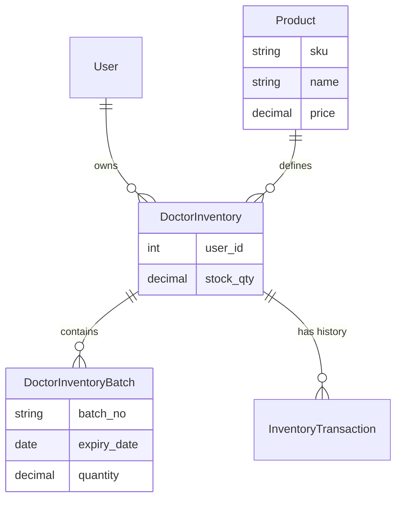

# Inventory vs Clinic Products: Feature Comparison & Usage Guide

## 1. Overview

This document clarifies the distinction between the **Clinic Products** (Master Catalog) and **Doctor Inventory** (Personal Stock) modules in the Birawa App. Understanding this separation is crucial for correct data management and reporting.

### Summary
*   **Clinic Products (`products` table)**: The master catalog of all items available in the clinic. It represents the "definition" of an item (e.g., "Amoxicillin 500mg") and potentially the central warehouse stock.
*   **Doctor Inventory (`doctor_inventories` table)**: The specific stock held by an individual doctor (e.g., in their bag or van). It tracks actual quantities and batches assigned to a specific user.

---

## 2. Feature Purposes & Use Cases

| Feature | Primary Purpose | Use Cases |
| :--- | :--- | :--- |
| **Clinic Products** | Master Data Management | • Defining new medicines/items • Setting base prices and costs • Central stock tracking (if applicable) • Reporting on overall product performance |
| **Doctor Inventory** | Personal Stock Management | • Tracking what a doctor has in their bag • Managing batch expiries for safety • Consuming items during visits (Medical Usage) • Restocking requests from central supply |

---

## 3. Data Ownership & Permissions

### Data Ownership Model
*   **Clinic Products**: Owned by the **Clinic**. Changes affect everyone. Managed by Administrators or Inventory Managers.
*   **Doctor Inventory**: Owned by the **Doctor (User)**. Each doctor has their own isolated inventory list. Changes (usage) only affect that doctor's stock.

### Permission Matrix

| Action | Clinic Product | Doctor Inventory |
| :--- | :--- | :--- |
| **Create Item** | Admin / Manager | System (via Restock/Transfer) |
| **Edit Details** | Admin / Manager | Doctor (limited: quantity adjustments if allowed) |
| **View** | All Staff | Owner (Doctor) & Admin |
| **Delete** | Admin | System (when stock hits 0) |

---

## 4. Database Schema Comparison

### Products Table (`products`)
Represents the "Type" of item.
*   `id`: Unique identifier
*   `sku`: Stock Keeping Unit (Barcode)
*   `name`: Item Name
*   `category`: Medicine, Consumable, Equipment, etc.
*   `cost`: Base Cost Price
*   `price`: Base Selling Price
*   `stock`: Central/Clinic Stock Level

### Doctor Inventory Table (`doctor_inventories`)
Represents "Instances" of items held by a doctor.
*   `id`: Unique identifier
*   `user_id`: Link to the Doctor (Owner)
*   `product_id` (implied/linked): Reference to the master product
*   `stock_qty`: Current quantity on hand
*   `average_cost_price`: Weighted average cost of current stock
*   **Has Many `batches` (`doctor_inventory_batches`)**:
    *   `batch_number`: Manufacturer batch code
    *   `expiry_date`: Expiry date for safety checks
    *   `quantity`: Quantity in this specific batch

---

## 5. Business Logic & Workflows

### A. Restocking Flow (Central -> Doctor)
1.  **Request**: Doctor requests stock or Admin initiates transfer.
2.  **Transfer**: Items are moved from Central Stock (optional) or external purchase.
3.  **Creation**: A `DoctorInventory` record is created/updated for the doctor.
4.  **Batching**: A `DoctorInventoryBatch` is created with expiry details.

### B. Usage Flow (During Visit)
1.  **Selection**: Doctor selects item from *their* `DoctorInventory` during a medical record creation.
2.  **Validation**: System checks if `stock_qty` > required amount.
3.  **Deduction**:
    *   System finds the oldest valid batch (FIFO - First In First Out).
    *   Deducts quantity from the batch.
    *   Deducts quantity from the main `DoctorInventory` record.
4.  **Logging**: Usage is logged in `MedicalUsageLog` for billing and audit.

---

## 6. Reporting Capabilities

*   **Stock Opname**: Doctors can perform stock opname on their own inventory to verify physical vs system counts.
*   **Expiry Reports**: System generates alerts for `DoctorInventoryBatch` items nearing expiry.
*   **Usage Reports**: Reports on how much stock a doctor consumes per month/visit.

## 7. Integration Points

*   **Invoicing**: When a doctor uses an item, it can automatically be added to the invoice based on the `Product` master price.
*   **Medical Records**: Inventory usage is directly linked to the medical record "Plan/Treatment" section.

---

## Visual Summary (ERD Concept)

